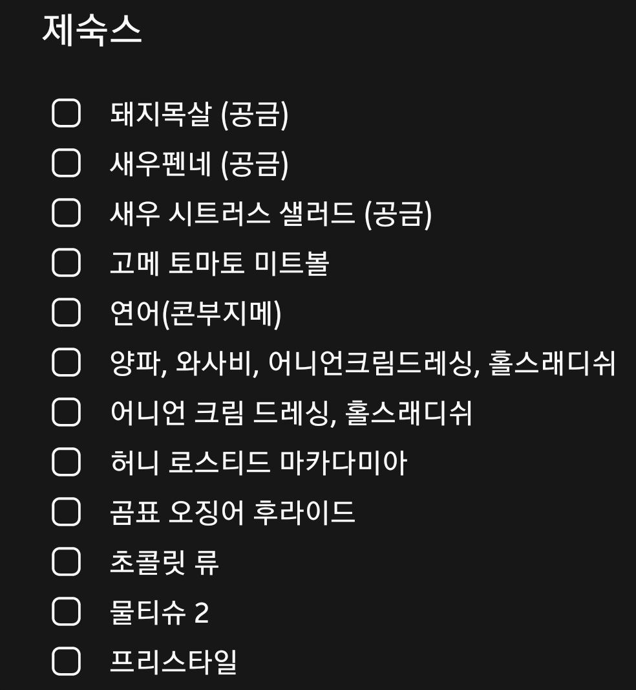

# 멤버별 역할 정리

### 제스

- To bring
    - 프링글스
    - 조니워커 블랙라벨
    - 뱅루미큐브러브젠가트럼프닌텐도
    - 마켓컬리 주문 → 다후 집으로
- 기타 레크 준비
- 숙소 상황 finalize (식기 등 필요사항 체크)

### 다후

- To bring
    - 공금 → 후불
    고기는.. 8인 기준으로 적당한 무게로 부탁드려요!
        
        
        
    - Johnson’s Army Stew
- Pick up
    - 이태원에서 제스, 고몽 픽업

### 거룽

- To bring
    - 노래방 스피커 + 마이크
    - [**야놀자 존쿡**](https://m.johncook.co.kr/goods/goods_view.php?goodsNo=1000000357)
    - 배흥동 5팩
    - 컵라면 박스 
    (이건 형이 골라요!)

### 메그

- To bring
    - 저번에 사놓은 것들 부탁드려요!
    - 화요!

### 웅석

- 그레이구스
- 짐빔 화이트
- 달모어
- 와인
- 레웅 한서 픽업

### 고몽

- 연태고량주
- 고든스
- 레미마틴
- 토닉 600ml * 4
- 핸드릭스
- 오이, 라임, 시럽 블랜드
- 베일리스 레드벨벳컵케익
- 일회용 컵
- 트러플 솔트
- 음3초맞 게임 준비

### 레웅, 한서

늦지 않게 웅석햄이랑 만나서 올라오기